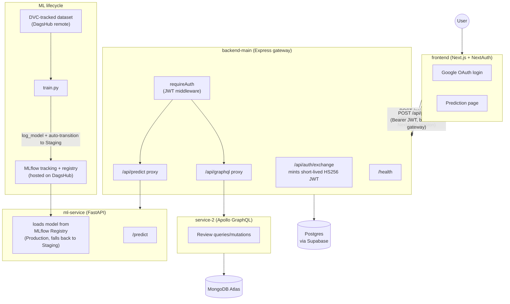

# InsightAPI MLOps

A monorepo for InsightAPI: a Next.js frontend, an Express API gateway, a GraphQL microservice, and a FastAPI sentiment-classification service, tied together with an MLflow/DVC-based ML lifecycle.

## Architecture



`backend-main` is the single entry point the frontend talks to — `ml-service` and `service-2` are never exposed directly. `requireAuth` gates `/api/predict` and `/api/graphql` behind a short-lived JWT minted by the token-exchange flow below.

## Tech stack

| Service | Stack | Port (dev) |
|---|---|---|
| `frontend/` | Next.js 16 (App Router), React 19, Tailwind CSS 4, NextAuth v4 (Google OAuth) | 3000 |
| `backend-main/` | Node 22, Express, TypeScript, `jsonwebtoken`, `http-proxy-middleware`, `cors`, `pg` | 3000* |
| `service-2/` | Node 22, Apollo Server 5, GraphQL, Mongoose (MongoDB Atlas) | 4002 |
| `ml-service/` | Python 3.11, FastAPI, uvicorn, scikit-learn, pandas, MLflow, DVC, `prometheus-client` | 8000 |

\* `backend-main` currently defaults to port 3000, same as the frontend's Next.js default — when running both locally you must override one (see Reproducibility below).

Data stores: Postgres (Supabase-hosted, used by `backend-main`) and MongoDB Atlas (used by `service-2`). Experiment tracking, the model registry, and DVC's remote storage are all hosted on DagsHub.

### Auth flow

1. User logs in with Google via NextAuth in the frontend.
2. The frontend's own server route (`/api/token`) reads the already-validated NextAuth session and calls `backend-main`'s `/api/auth/exchange`, authenticated with a shared `INTERNAL_EXCHANGE_SECRET` (proves the caller is the trusted frontend server, not an arbitrary client claiming an identity).
3. `backend-main` mints a 15-minute HS256 JWT (`JWT_SECRET`) for that identity and returns it.
4. The browser attaches that JWT as a Bearer token on direct, CORS-enabled calls to `/api/predict` (allowed origin controlled by `FRONTEND_URL`).

This whole flow — the Google OAuth login button, the `/predict` page, and `backend-main`'s `/api/auth/exchange` + `requireAuth` + CORS — is merged into `dev` (PR #16) and verified working end to end. The Playwright e2e test covering it (`frontend/e2e/predict.spec.ts`) logs in through a test-only credentials provider rather than scripting Google's real consent screen (not automatable in CI), but everything downstream of login — the NextAuth session, the token exchange, the JWT-gated proxy call — is the real code path.

## CI/CD

The lint/unit/integration steps are factored into a single reusable workflow, `.github/workflows/test-suite.yml`, called from both pipelines below via `workflow_call`:
1. **Lint** — all four services (`npm run lint` for frontend/backend-main/service-2, `ruff check .` for ml-service).
2. **Unit tests** — `backend-main` (`npm test`) and `ml-service` (`pytest -q`).
3. **Integration tests** — boots real `postgres:16` and `mongo:7` containers, starts `backend-main` against Postgres (asserts `/health` reports a real DB connection) and `service-2` against MongoDB (runs a real `createReview` mutation, then reads it back via a GraphQL query).

**Done — `dev` PRs:** `.github/workflows/ci-pr-to-dev.yml` runs `test-suite.yml`, then builds (does not push) a Docker image for all four services.

**Done — `dev` → `staging`:** `.github/workflows/cd-merge-to-staging.yml` triggers on push to `staging`. It runs `test-suite.yml`, builds and pushes all four images to GHCR (`ghcr.io/<repo>/<service>:staging` and `:<sha>`), then deploys each service to Railway with the `railway up` CLI (one step per service, using a `RAILWAY_SERVICE_ID_*` secret each plus a shared `RAILWAY_TOKEN`, on the `staging` GitHub Environment).
- Note from the workflow's own comments: `railway up` has Railway build each service itself from its Dockerfile at deploy time — it does **not** deploy the image just pushed to GHCR. That push still acts as a real build gate (the deploy job only runs if it succeeded) and an audit trail, but the artifact actually running on Railway is built independently by Railway.
- The post-deploy smoke-test step is commented out pending real staging URLs.
- **This pipeline only exists on `dev` right now** — GitHub Actions triggers off the workflow file present on the branch being pushed to, and `staging` doesn't have this file yet. It won't actually fire until `dev` is merged into `staging` once.
- The workflow's inline comments about "NextAuth isn't wired into frontend/ on dev yet" and the gateway/auth routes being unmerged are now stale — both landed on `dev` since that workflow was written (see Auth flow above) — worth a follow-up doc fix in the workflow file itself.

**TODO — not started:**
- [ ] `staging` → `main` promotion pipeline (no workflow file exists on any branch).

## Model promotion

`ml-service/train.py`:
- Loads the DVC-tracked dataset, trains the sentiment classifier, and logs params/metrics to the `sentiment-classifier` experiment in MLflow (tracking server hosted on DagsHub).
- Registers the model under `insightapi-sentiment-classifier` and **automatically transitions every new version to the `Staging` stage**.

`ml-service/api.py` loads whichever version is in `Production`, falling back to `Staging` if no `Production` version exists yet — so a freshly trained model is servable immediately without any manual step, but it's serving from `Staging` until promoted.

**TODO:** there is no automated or manual step in this repo that promotes a model version from `Staging` to `Production`. Until one exists, promotion has to be done by hand — via the MLflow UI on DagsHub, or:
```python
MlflowClient().transition_model_version_stage(
    name="insightapi-sentiment-classifier", version=<n>, stage="Production",
)
```

## Deployment

Each of the four services deploys to **Railway** as an independent service with its own domain — there is no shared host/port, so every downstream URL (`ML_SERVICE_URL`, `SERVICE_2_URL`, `BACKEND_URL`/`NEXT_PUBLIC_BACKEND_URL`, `FRONTEND_URL`) must be set to the other services' real Railway URLs in each environment's variables, not left at their `localhost` defaults. Deploys are triggered by `cd-merge-to-staging.yml` (see CI/CD above) via the Railway CLI (`railway up --service=... --environment staging --ci`), driven by GitHub secrets: one shared `RAILWAY_TOKEN` plus one `RAILWAY_SERVICE_ID_*` per service.

Runtime env vars are configured directly on each Railway service (via the dashboard or `railway variables --set`) — separately from the GitHub secrets above, which only authenticate the deploy trigger itself:

| Service | Build | Runtime env needed on Railway |
|---|---|---|
| `frontend/` | `frontend/Dockerfile` (Next.js standalone output) | `NEXTAUTH_URL`, `NEXTAUTH_SECRET`, `GOOGLE_CLIENT_ID`, `GOOGLE_CLIENT_SECRET`, `BACKEND_URL`, `NEXT_PUBLIC_BACKEND_URL`, `INTERNAL_EXCHANGE_SECRET` |
| `backend-main/` | `backend-main/Dockerfile` | `DATABASE_URL`, `JWT_SECRET`, `INTERNAL_EXCHANGE_SECRET`, `FRONTEND_URL`, `ML_SERVICE_URL`, `SERVICE_2_URL`, `PORT` |
| `service-2/` | `service-2/Dockerfile` | `MONGODB_URI`, `PORT` |
| `ml-service/` | `ml-service/Dockerfile` | `MLFLOW_TRACKING_URI`, `MLFLOW_TRACKING_USERNAME`, `MLFLOW_TRACKING_PASSWORD`, `PORT` |

For `ml-service`, (re)deploying *is* the "promote a candidate to staging" action in practice: `api.py`'s startup hook resolves the model from the MLflow Registry itself (`Production`, falling back to `Staging`) — there's no separate artifact-copy step, so redeploying the container with the right MLflow env vars picks up whatever is currently registered.

**TODO — not started / known gaps:**
- [ ] No Railway config (`railway.json`/`railway.toml`) is committed — services are configured directly on Railway/via the CLI, not as code.
- [ ] **`ml-service/Dockerfile`'s `CMD` still runs `python train.py`, not `uvicorn api:app`** — confirmed still the case after merging the latest `dev` for this README. This means the `ml-service` deploy step in `cd-merge-to-staging.yml` would currently have Railway run the training script as its "web service," not the FastAPI app — `/predict` would not actually be reachable on a freshly deployed `ml-service`. This needs fixing before staging deploys are useful for the prediction API.
- [ ] Root `docker-compose.yml` is still an empty stub (service names only, no config) — useful for local multi-service dev, not required for Railway.
- [ ] **Grafana dashboard** — `ml-service` now exposes `GET /metrics` in Prometheus exposition format (request counts, failure counts, latency histogram, uptime and health gauges — see `ml-service/README.md`), but there is no Prometheus server or Grafana dashboard/data-source config anywhere in the repo yet to scrape or visualize it.

## Reproducibility

### 1. Clone

```bash
git clone <repo-url>
cd insightapi-mlops
```

### 2. Environment variables

Each service has its own `.env.example` — copy and fill in real values:

```bash
cp backend-main/.env.example backend-main/.env
cp frontend/.env.example frontend/.env.local
cp ml-service/.env.example ml-service/.env
```

| Service | Variable | Notes |
|---|---|---|
| `backend-main` | `DATABASE_URL` | Postgres connection string |
| | `PORT` | default `3000` — set to e.g. `4000` locally to avoid colliding with the frontend |
| | `JWT_SECRET` | signs/verifies the short-lived app JWT |
| | `INTERNAL_EXCHANGE_SECRET` | shared with frontend's `/api/token` route |
| | `FRONTEND_URL` | allowed CORS origin, e.g. `http://localhost:3000` |
| | `ML_SERVICE_URL`, `SERVICE_2_URL` | downstream services to proxy to |
| `frontend` | `NEXTAUTH_URL`, `NEXTAUTH_SECRET` | NextAuth config |
| | `GOOGLE_CLIENT_ID`, `GOOGLE_CLIENT_SECRET` | Google OAuth app credentials |
| | `BACKEND_URL` | server-side URL to `backend-main`, e.g. `http://localhost:4000` |
| | `NEXT_PUBLIC_BACKEND_URL` | same URL, exposed to the browser |
| | `INTERNAL_EXCHANGE_SECRET` | must match `backend-main`'s value |
| `ml-service` | `MLFLOW_TRACKING_URI`, `MLFLOW_TRACKING_USERNAME`, `MLFLOW_TRACKING_PASSWORD` | DagsHub-hosted MLflow |
| `service-2` | `MONGODB_URI` | MongoDB Atlas connection string |
| | `PORT` | optional, default `4002` |

> **TODO:** `service-2` has no `.env.example` yet even though its own README references one — add one documenting `MONGODB_URI` and `PORT`.

### 3. Install dependencies

```bash
cd frontend && npm install && cd ..
cd backend-main && npm install && cd ..
cd service-2 && npm install && cd ..
cd ml-service && pip install -r requirements.txt && cd ..
```

### 4. Run everything locally

```bash
# ml-service — needs a model already registered in MLflow (see training below)
cd ml-service && uvicorn api:app --reload

# service-2
cd service-2 && npm run dev

# backend-main — override PORT so it doesn't collide with the frontend
cd backend-main && PORT=4000 npm run dev

# frontend
cd frontend && npm run dev
```

Then open `http://localhost:3000`, log in with Google, go to **Try sentiment prediction**, and submit some text.

### 5. Run the training pipeline

```bash
cd ml-service

# one-time: authenticate the DVC remote against DagsHub
dvc remote modify origin --local auth basic
dvc remote modify origin --local user <dagshub-username>
dvc remote modify origin --local password <dagshub-token>

dvc pull          # fetch the tracked dataset
python3 train.py  # trains, logs to MLflow, registers + auto-promotes to Staging
```

`api.py` will pick up the new `Staging` version the next time it starts (or `Production`, once that promotion step exists — see Model promotion above).
